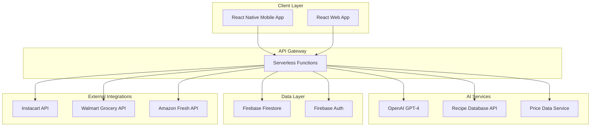

# Design Document

## Overview

The AI-Driven Meal Planning & Grocery Assistant is designed as a cross-platform mobile and web application that leverages modern cloud services, AI APIs, and third-party integrations to deliver a seamless meal planning experience. The architecture follows a serverless, API-first approach that enables rapid development while maintaining scalability and security.

The system consists of three main layers:
- **Client Layer**: React Native mobile apps (iOS/Android) and React web application
- **API Layer**: Node.js serverless functions handling business logic and AI orchestration  
- **Data Layer**: Firebase Firestore for real-time data storage and Firebase Auth for user management

Key design principles include:
- **AI-First**: Leverage large language models for intelligent meal planning and personalization
- **Budget-Aware**: All recommendations consider cost constraints and optimization
- **Learning System**: Continuous improvement through user feedback and preference tracking
- **Integration-Ready**: Modular design for easy addition of grocery partners and recipe sources

## Architecture

### System Architecture Diagram



### Data Flow Architecture

The system follows a request-response pattern with real-time updates:

1. **User Input**: Profile setup, meal plan requests, feedback
2. **AI Processing**: Serverless functions orchestrate calls to OpenAI and recipe APIs
3. **Data Storage**: Results stored in Firestore with real-time sync to clients
4. **External Integration**: Grocery list conversion to partner shopping carts
5. **Feedback Loop**: User interactions feed back into personalization algorithms

## Components and Interfaces

### Client Components

#### Mobile App (React Native)
- **OnboardingFlow**: Multi-step profile setup with form validation
- **MealPlanView**: Weekly calendar interface with meal cards and swap functionality
- **GroceryListView**: Categorized shopping list with budget tracking and checkoff capability
- **PantryManager**: Inventory tracking with expiration date monitoring
- **RecipeViewer**: Full recipe display with step-by-step cooking guidance
- **FeedbackInterface**: Simple rating system with reason categorization

#### Web App (React/Next.js)
- Responsive versions of all mobile components
- Enhanced desktop features like multi-column layouts
- Keyboard shortcuts for power users
- Print-friendly grocery lists and meal plans

### API Layer Components

#### Core Services

**UserProfileService**
```typescript
interface UserProfile {
  userId: string;
  householdSize: number;
  dietaryRestrictions: string[];
  cuisinePreferences: string[];
  cookingSkillLevel: 'beginner' | 'intermediate' | 'advanced';
  weeklyBudget: number;
  cookingTimePreference: {
    weekday: number; // minutes
    weekend: number; // minutes
  };
}
```

**MealPlanService**
```typescript
interface MealPlan {
  id: string;
  userId: string;
  weekStartDate: Date;
  meals: Meal[];
  totalEstimatedCost: number;
  budgetStatus: 'under' | 'at' | 'over';
}

interface Meal {
  id: string;
  dayOfWeek: number;
  mealType: 'breakfast' | 'lunch' | 'dinner';
  recipeName: string;
  description: string;
  prepTime: number;
  cookTime: number;
  servings: number;
  estimatedCost: number;
  ingredients: Ingredient[];
  recipeId: string;
}
```

**GroceryListService**
```typescript
interface GroceryList {
  id: string;
  mealPlanId: string;
  items: GroceryItem[];
  totalCost: number;
  budgetComparison: number;
  suggestedSwaps?: CostSavingSwap[];
}

interface GroceryItem {
  name: string;
  quantity: string;
  category: string;
  estimatedPrice: number;
  isInPantry: boolean;
  pantryQuantity?: string;
}
```

#### AI Integration Services

**MealPlanGenerator**
- Orchestrates OpenAI API calls with structured prompts
- Integrates recipe database lookups for ingredient lists
- Applies budget constraints and user preferences
- Handles meal swapping and alternative suggestions

**PersonalizationEngine**
- Processes user feedback to build taste profiles
- Implements collaborative filtering for recipe recommendations
- Manages learning algorithms for continuous improvement
- Tracks preference patterns and dietary adherence

**BudgetOptimizer**
- Analyzes meal plan costs against budget targets
- Suggests ingredient substitutions for cost savings
- Implements smart swapping algorithms
- Integrates real-time price data from grocery partners

### External Integration Layer

#### Grocery Partner Integrations

**ShoppingService Interface**
```typescript
interface ShoppingService {
  addItemsToCart(items: GroceryItem[]): Promise<CartResult>;
  searchProduct(query: string): Promise<Product[]>;
  getProductPrice(productId: string): Promise<number>;
}

class InstacartService implements ShoppingService {
  // Implementation for Instacart API integration
}

class WalmartService implements ShoppingService {
  // Implementation for Walmart Grocery API integration
}
```

#### Recipe Data Integration

**RecipeService**
- Integrates with Spoonacular or Edamam APIs
- Provides structured recipe data with ingredients and instructions
- Handles recipe search and filtering by dietary restrictions
- Manages recipe caching for performance optimization

## Data Models

### User Data Schema

```typescript
// Firestore Collections Structure

// Users Collection
interface UserDocument {
  profile: UserProfile;
  preferences: UserPreferences;
  createdAt: Timestamp;
  lastActiveAt: Timestamp;
}

// MealPlans Collection
interface MealPlanDocument {
  userId: string;
  weekOf: Timestamp;
  meals: Meal[];
  status: 'draft' | 'active' | 'completed';
  feedback: MealFeedback[];
  createdAt: Timestamp;
}

// Pantry Collection
interface PantryDocument {
  userId: string;
  items: PantryItem[];
  lastUpdated: Timestamp;
}

interface PantryItem {
  name: string;
  quantity: string;
  purchaseDate: Timestamp;
  expirationDate?: Timestamp;
  category: string;
}

// Feedback Collection
interface FeedbackDocument {
  userId: string;
  mealId: string;
  rating: 'positive' | 'negative';
  reasons: string[];
  comment?: string;
  timestamp: Timestamp;
}
```

### Recipe Data Schema

```typescript
interface Recipe {
  id: string;
  name: string;
  description: string;
  prepTime: number;
  cookTime: number;
  servings: number;
  difficulty: 'easy' | 'medium' | 'hard';
  cuisine: string[];
  dietaryTags: string[];
  ingredients: RecipeIngredient[];
  instructions: string[];
  nutritionInfo: NutritionInfo;
  averageRating?: number;
  costEstimate?: number;
}

interface RecipeIngredient {
  name: string;
  amount: number;
  unit: string;
  category: string;
  substitutions?: string[];
}
```

## Error Handling

### Client-Side Error Handling

**Network Errors**
- Implement retry logic with exponential backoff
- Show user-friendly offline messages
- Cache critical data for offline functionality
- Graceful degradation when AI services are unavailable

**Validation Errors**
- Real-time form validation with clear error messages
- Prevent invalid data submission
- Guide users to correct input format issues

**AI Service Errors**
- Fallback to cached meal plans when AI generation fails
- Provide manual meal selection options
- Clear communication when AI features are temporarily unavailable

### Server-Side Error Handling

**API Rate Limiting**
- Implement rate limiting per user to prevent abuse
- Queue requests during high traffic periods
- Provide clear feedback about rate limit status

**External Service Failures**
- Circuit breaker pattern for external API calls
- Fallback data sources for recipe and price information
- Graceful handling of grocery partner API outages

**Data Consistency**
- Transaction handling for critical operations
- Conflict resolution for concurrent updates
- Data validation at API boundaries

### Error Monitoring and Logging

```typescript
interface ErrorLog {
  timestamp: Timestamp;
  userId?: string;
  errorType: string;
  errorMessage: string;
  stackTrace?: string;
  context: {
    function: string;
    parameters: any;
    userAgent?: string;
  };
}
```

## Testing Strategy

### Unit Testing
- **Frontend**: Jest and React Testing Library for component testing
- **Backend**: Jest for serverless function testing
- **AI Integration**: Mock OpenAI responses for consistent testing
- **Data Layer**: Firebase emulator for database operation testing

### Integration Testing
- **API Endpoints**: Test complete request/response cycles
- **External Services**: Test grocery partner integrations with sandbox environments
- **User Flows**: End-to-end testing of critical user journeys

### Performance Testing
- **Load Testing**: Simulate concurrent users during meal plan generation
- **AI Response Times**: Monitor and optimize OpenAI API call performance
- **Database Performance**: Test Firestore query performance under load

### User Acceptance Testing
- **Beta Testing**: Closed beta with 20-30 real families
- **Usability Testing**: Task-based testing of core workflows
- **Accessibility Testing**: Ensure compliance with WCAG guidelines

### Testing Automation

```typescript
// Example test structure
describe('MealPlanService', () => {
  describe('generateWeeklyPlan', () => {
    it('should generate plan within budget constraints', async () => {
      const userProfile = createTestProfile({ weeklyBudget: 150 });
      const mealPlan = await MealPlanService.generateWeeklyPlan(userProfile);
      
      expect(mealPlan.totalEstimatedCost).toBeLessThanOrEqual(150);
      expect(mealPlan.meals).toHaveLength(21); // 7 days × 3 meals
    });
    
    it('should respect dietary restrictions', async () => {
      const userProfile = createTestProfile({ 
        dietaryRestrictions: ['vegetarian', 'nut-free'] 
      });
      const mealPlan = await MealPlanService.generateWeeklyPlan(userProfile);
      
      mealPlan.meals.forEach(meal => {
        expect(meal.ingredients).not.toContainMeat();
        expect(meal.ingredients).not.toContainNuts();
      });
    });
  });
});
```

### Continuous Integration Pipeline
- **Automated Testing**: Run full test suite on every commit
- **Code Quality**: ESLint, Prettier, and TypeScript strict mode
- **Security Scanning**: Automated vulnerability scanning
- **Performance Monitoring**: Track key metrics in production

This design provides a solid foundation for building the AI meal planner while maintaining flexibility for future enhancements and integrations. The modular architecture ensures that individual components can be developed, tested, and deployed independently, supporting the aggressive development timeline outlined in the strategy document.